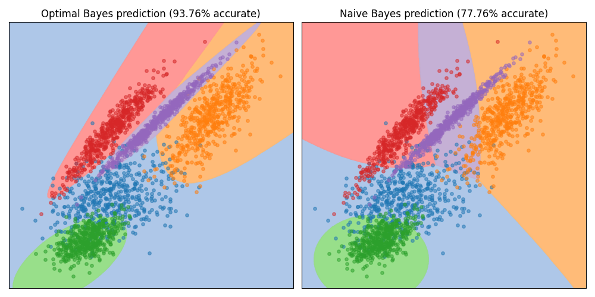

# Bayes Classifier built in Rust

Simple Python-module built in Rust to classify large data sets concurrently in seconds using optimal Bayes classification. Compared with Naive Bayesian classification, where it is assumed that the covariance matrix only has diagonal entries, optimal Bayesian classification uses the entire covariance matrix, allowing for correlated features.

Building the module in rust allows for effecient and concurrent evaluation of the samples, making this implementation orders of magnitudes faster than doing the same in pure Python. This speed difference is important, since optimal Bayes suffers from curse of dimensionality.

## Usage

The most basic use of the classifier involves fitting a gaussian distribution to each class based the training data and the corresponding labels. 

``` python
from rust_bayes import classifier

X = # numpy array containing training data 
y = # numpy array containing data labels 

# Get classifier object
bayes = classifier()

# Fit the model to a data set
bayes.fit(X,y)
```
Then subsequent data sets or data samples can predicted.

``` python
X_test = # numpy array containing unseen data

# Predict class of unseen data
predicton = bayes.predict(X_test)
```

## Difference between optimal vs. naive approach

Assuming non-correlation between features is fine for some problems, but may cause problems for others, where features are more correlated. See the example below, where the distributions are very 'diagonal' on the plot. The optimal classification does fine here.

Compare this with the naive approach, where these distributions cannot be represented accurately, which results in worse classification accuracy.



**Note** : This example is generated to specifically highlight the difference.
