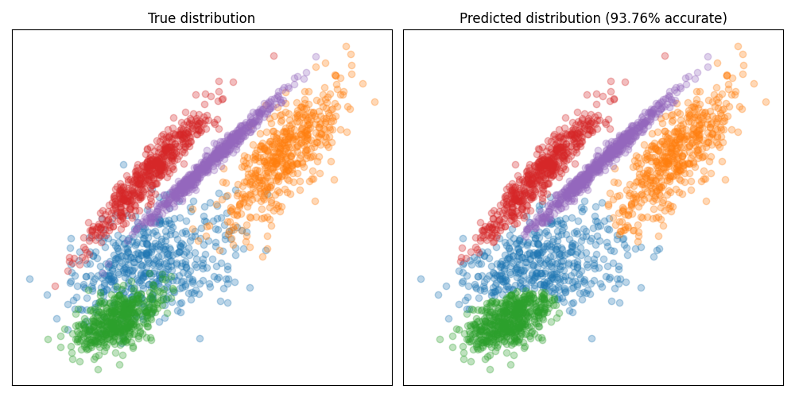
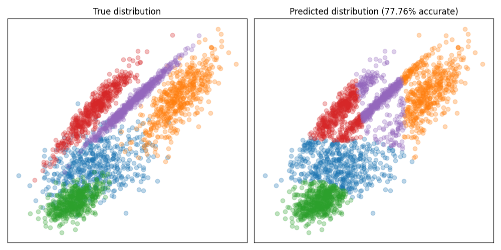

# Bayes Classifier built in Rust

Simple Python-module built in Rust to classify large data sets concurrently in seconds using Bayes classification. Compared with Naive Bayesian classification, where it is assumed that the covariance matrix only has diagonal entries, a "full" Bayesian classification uses the entire covariance matrix, allowing for correlated features. Building the module in rust allows for effecient and concurrent evaluation of the samples, making this implementation orders of magnitudes faster than doing the same in pure Python. Speaking from experience on that one.

## Usage

The most basic use of the classifier involves fitting a gaussian distribution to each class based the training data and the corresponding labels. Then the class subsequent data sets or data samples can predicted.

``` python
from rust_bayes import classifier

X = # DataFrame containing data to classify 
y = # DataFrame containing data labels 

# Get classifier object
bayes = classifier()

# Fit the model to a data set
bayes.fit(X,y)

# Predict 
est = bayes.predict(X_test)
```

## Difference between naive vs. non-naive approach

Assuming non-correlation between features is fine for some problems, but may cause problems for other types of problems, where features are more correlated. See the example below, where the distributions are very 'diagonal' on the plot. The non-naive classification does fine here.

### Bayes Classification


Compare this with the naive approach, where these distributions cannot be represented accurately, which results in worse classification accuracy.

### Naive Bayes Classification
